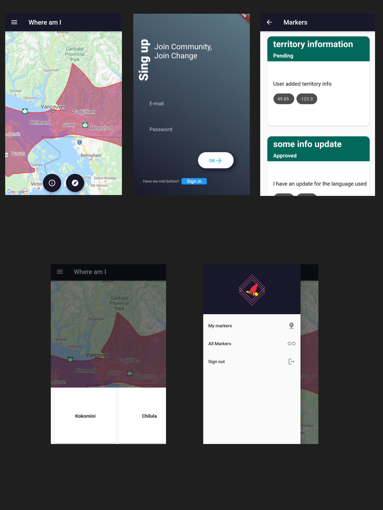

<div align="center"><h1>Where am I</h1></div>
<div align="center"><h3>An application that tells you which native land you are on and explore other native territories around the globe.</h3></div>
<div align="center"></div>


<pre><div align="center">      </div></pre> 


# Table of Content:

- [Display Shots](#display-shots)
- [Running the project](#running-the-project)
- [Stack in use](#stack-in-use)
- [Future scope](#future-scope)
- [Demo video](#demo-video)


## Display Shots


<div align="center"></div><br/>
 


## Running the project
- Clone the project
- Open the project is VS code (or your favorite editor)
- Locate the VS Code status bar (the blue bar at the bottom of the window):
- Select a device from the Device Selector area
- Invoke Run > Start Debugging or press f5
- Wait for the app to launch — progress is printed in the Debug Console view.


## Stack in use
- Fontend : Frontend is setup using flutter and programmed in a way that it can be ran on desktop , web and android/ios !
- Node.js : All the calls to database go through node.js server where the user and data is validated before forwarding it to the database.
- Database : We are using Firestore as a database


## Future scope
- Email verify all users before they can submit any information for approval 
- Add Firebase cloud messaging (Push notification) so that users get notified whenever their information is approved
- Add award system so that users get an incentive for using the app 
- Feature to post pdf of research papers, any interviews they did or any images as information
- Use All markers as a community feature where others can comment on an information submitted by a user and make a thread and so on


## Demo video
```
https://youtu.be/9vgBisFuGQg
```
